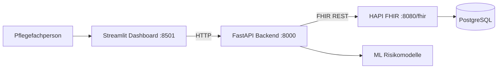
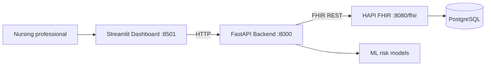

# Pflege Monitoring FHIR

Deutsch | [English](#english)

## Deutsch

### Überblick

Pflege Monitoring FHIR ist eine containerisierte Demo-Anwendung für die pflegerische Verlaufsdokumentation. Das System verbindet ein Streamlit-Dashboard, eine FastAPI-Anwendung, einen HAPI-FHIR-Server und PostgreSQL. Klinische Daten werden als FHIR-Ressourcen gespeichert; das Frontend speichert keine Patientendaten lokal.

> Hinweis: Die Anwendung verwendet synthetische Demonstrationsdaten und ML-Modelle. Sie ist kein Medizinprodukt und ersetzt weder eine professionelle pflegerische Einschätzung noch klinische Entscheidungen.

### Funktionen

- Patienten anlegen, suchen, Stammdaten ändern und nach Bestätigung löschen
- Suche nach Nachname, Vorname und Geburtsdatum
- Vitalzeichen und Assessments erfassen:
	- Blutdruck mit systolischem und diastolischem Wert
	- Herzfrequenz, Temperatur, Atemfrequenz und Sauerstoffsättigung
	- Schmerz-, Mobilitäts- und Morse-Sturzscore
- Patientenbezogene Verlaufskurven für alle numerischen Messwerte
- Pflegeakte mit Diagnosen, Medikamenten, Allergien, Pflegeberichten und Pflegeplänen
- Risikoeinschätzung für Sturz, Dekubitus, Schmerzeskalation und klinische Verschlechterung
- Fachlich lesbare Observationsdetails sowie Statuskorrektur und Löschung von Observationen
- Vollständiger Patientenbericht mit Stammdaten, Pflegeakte, letzten Messwerten und Risikoeinschätzungen

### Architektur



| Komponente | Technologie | Aufgabe |
| --- | --- | --- |
| Frontend | Streamlit | Pflege-Dashboard und Dokumentation |
| Backend | FastAPI / Uvicorn | Validierte API und FHIR-Proxy |
| FHIR-Server | HAPI FHIR | Speicherung der klinischen Ressourcen |
| Datenbank | PostgreSQL 16 | Persistenz für HAPI FHIR |
| ML | scikit-learn / joblib | Synthetische Pflege-Risikoeinschätzungen |

### Schnellstart mit Docker

Voraussetzung: Docker Desktop mit Docker Compose.

```powershell
docker compose up --build
```

Beim ersten Start lädt Docker die HAPI- und PostgreSQL-Images und installiert die Python-Abhängigkeiten. Der FHIR-Server benötigt etwas Zeit für seine Initialisierung. Sobald die Dienste bereit sind, sind diese Adressen verfügbar:

| Dienst | Adresse |
| --- | --- |
| Pflege-Dashboard | http://localhost:8501 |
| Backend-API / OpenAPI | http://localhost:8000/docs |
| HAPI-FHIR-Server | http://localhost:8080/fhir |

Zum Beenden:

```powershell
docker compose down
```

Die FHIR-Daten bleiben im benannten Docker-Volume `hapi-postgres-data` erhalten. Für einen vollständigen Neustart mit leeren Daten:

```powershell
docker compose down -v
```

### Anwendung bedienen

1. Öffne das Dashboard unter http://localhost:8501.
2. Lege unter **Patient aufnehmen** einen Patienten an.
3. Öffne **Patienten**, suche den Patienten und wähle ihn aus.
4. Bearbeite bei Bedarf die Stammdaten oder lösche den Patienten nach ausdrücklicher Bestätigung.
5. Dokumentiere unter **Übersicht** oder **Observationen** die Vitalzeichen und Assessments.
6. Verwende in der Patientenübersicht die **Pflegeakte**, um Diagnosen, Medikamente, Allergien, Pflegeberichte und Maßnahmen zu dokumentieren.
7. Öffne **Observationen**, um den Verlauf als Kurve und den automatisch erzeugten Patientenbericht zu sehen.

### FHIR-Ressourcen

| Pflegeinhalt | FHIR-Ressource |
| --- | --- |
| Stammdaten | `Patient` |
| Vitalzeichen und Scores | `Observation` |
| Diagnosen | `Condition` |
| Medikamente | `MedicationStatement` |
| Allergien | `AllergyIntolerance` |
| Pflegebericht | `ClinicalImpression` |
| Pflegeplanung und Maßnahmen | `CarePlan` |
| Risikoeinschätzung im Backend | `RiskAssessment`-kompatible Antwort |

### Risikoeinschätzung

Für eine vollständige Modellberechnung müssen folgende Merkmale vorhanden sein:

- Geburtsdatum und Geschlecht
- Herzfrequenz
- systolischer und diastolischer Blutdruck
- Temperatur
- Atemfrequenz
- Sauerstoffsättigung
- Schmerzscore
- Mobilitätsscore
- Morse-Sturzscore

Fehlen Werte, zeigt die Anwendung transparent an, dass die Daten unvollständig sind. Dies verhindert, dass aus einer unvollständigen Datengrundlage eine scheinbar verlässliche Wahrscheinlichkeit abgeleitet wird.

### API-Übersicht

Die interaktive und vollständige API-Beschreibung steht nach dem Start unter http://localhost:8000/docs bereit.

| Methode | Pfad | Zweck |
| --- | --- | --- |
| `POST` | `/Patient` | Patienten anlegen |
| `GET` | `/Patient` | Patienten suchen |
| `GET`, `PUT`, `DELETE` | `/Patient/{patient_id}` | Patient lesen, ändern, löschen |
| `POST`, `GET` | `/Observation` | Observation anlegen, suchen |
| `GET`, `PATCH`, `DELETE` | `/Observation/{observation_id}` | Observation lesen, Status ändern, löschen |
| `POST`, `GET` | `/Patient/{patient_id}/clinical-records/{record_type}` | Pflegeakte speichern und lesen |
| `GET` | `/Patient/{patient_id}/nursing-risk-assessment` | Risikoeinschätzung abrufen |

Erlaubte Werte für `record_type` sind `Condition`, `MedicationStatement`, `AllergyIntolerance`, `ClinicalImpression` und `CarePlan`.

### Lokale Entwicklung ohne Docker

Voraussetzungen: Python 3.12, ein erreichbarer FHIR-Server und die Abhängigkeiten aus `requirements.txt`.

```powershell
python -m venv .venv
.\.venv\Scripts\Activate.ps1
pip install -r requirements.txt
```

In zwei Terminals starten:

```powershell
$env:FHIR_SERVER_URL = "http://localhost:8080/fhir"
uvicorn backend.app.main:app --reload --host 0.0.0.0 --port 8000
```

```powershell
$env:BACKEND_API_URL = "http://localhost:8000"
$env:PYTHONPATH = (Get-Location).Path
streamlit run frontend/app.py
```

### Konfiguration

| Variable | Standardwert | Verwendung |
| --- | --- | --- |
| `FHIR_SERVER_URL` | `http://localhost:8080/fhir` | FHIR-Basisadresse im Backend |
| `BACKEND_API_URL` | `http://localhost:8000` | Backend-Basisadresse im Frontend |
| `BACKEND_API_TOKEN` | nicht gesetzt | Optionaler Bearer-Token für Frontend-Anfragen |

Im Docker-Netzwerk werden die internen Namen `hapi-fhir` und `backend` verwendet. Die Zuordnung erfolgt in [docker-compose.yml](docker-compose.yml).

### Projektstruktur

```text
backend/
	app/
		main.py                 FastAPI-Routen
		fhir_ml/                FHIR-Client und ML-Risikologik
		models/                 Pydantic-Eingabemodelle
frontend/
	app.py                    Streamlit-Dashboard
	application/              Transformationen für UI-Daten
	domain/                   UI-Datenmodelle
	infrastructure/           Backend-API-Client
docker-compose.yml          Gesamtsystem: PostgreSQL, HAPI, Backend, Frontend
requirements.txt            Python-Abhängigkeiten
```

### Validierung

```powershell
.\.venv\Scripts\python.exe -m py_compile frontend/app.py backend/app/main.py
docker compose config
docker compose build backend frontend
```

---

## English

### Overview

Pflege Monitoring FHIR is a containerized demonstration application for nursing documentation and patient trends. It combines a Streamlit dashboard, a FastAPI application, a HAPI FHIR server, and PostgreSQL. Clinical data is stored as FHIR resources; the frontend does not persist patient data locally.

> Notice: The application uses synthetic demonstration data and ML models. It is not a medical device and does not replace professional nursing assessment or clinical decision-making.

### Features

- Create, search, edit, and confirmed-delete patients
- Search by family name, given name, and date of birth
- Record vital signs and assessments:
	- Blood pressure with systolic and diastolic values
	- Heart rate, temperature, respiratory rate, and oxygen saturation
	- Pain, mobility, and Morse fall scores
- Patient-specific trend charts for all numeric observations
- Nursing record for diagnoses, medications, allergies, nursing reports, and care plans
- Risk assessment for falls, pressure ulcers, pain escalation, and clinical deterioration
- Clinician-friendly observation details, status correction, and observation deletion
- A consolidated patient report with demographics, clinical record, recent observations, and risk assessments

### Architecture



| Component | Technology | Responsibility |
| --- | --- | --- |
| Frontend | Streamlit | Nursing dashboard and documentation UI |
| Backend | FastAPI / Uvicorn | Validated API and FHIR proxy |
| FHIR server | HAPI FHIR | Storage for clinical resources |
| Database | PostgreSQL 16 | Persistence layer for HAPI FHIR |
| ML | scikit-learn / joblib | Synthetic nursing risk assessments |

### Quick Start with Docker

Requirement: Docker Desktop with Docker Compose.

```powershell
docker compose up --build
```

On the first run, Docker downloads the HAPI and PostgreSQL images and installs the Python dependencies. The FHIR server needs a short initialization period. Once the services are ready, use:

| Service | Address |
| --- | --- |
| Nursing dashboard | http://localhost:8501 |
| Backend API / OpenAPI | http://localhost:8000/docs |
| HAPI FHIR server | http://localhost:8080/fhir |

Stop the stack:

```powershell
docker compose down
```

FHIR data is retained in the named Docker volume `hapi-postgres-data`. To remove all data and start fresh:

```powershell
docker compose down -v
```

### Dashboard Workflow

1. Open the dashboard at http://localhost:8501.
2. Create a patient under **Patient aufnehmen**.
3. Open **Patienten**, search for the patient, and select the record.
4. Edit demographic details or delete the patient after explicit confirmation when necessary.
5. Record vital signs and assessments under **Übersicht** or **Observationen**.
6. Use the **Pflegeakte** section in the patient overview to document diagnoses, medications, allergies, nursing reports, and care interventions.
7. Open **Observationen** to review trend charts and the generated patient report.

### FHIR Resources

| Clinical content | FHIR resource |
| --- | --- |
| Demographics | `Patient` |
| Vital signs and scores | `Observation` |
| Diagnoses | `Condition` |
| Medications | `MedicationStatement` |
| Allergies | `AllergyIntolerance` |
| Nursing report | `ClinicalImpression` |
| Care planning and interventions | `CarePlan` |
| Backend risk assessment | `RiskAssessment`-compatible response |

### Risk Assessment

A complete model calculation requires these data points:

- Date of birth and gender
- Heart rate
- Systolic and diastolic blood pressure
- Temperature
- Respiratory rate
- Oxygen saturation
- Pain score
- Mobility score
- Morse fall score

When values are absent, the dashboard explicitly reports incomplete data. This avoids presenting a seemingly reliable probability based on insufficient clinical information.

### API Summary

After startup, the interactive and complete API documentation is available at http://localhost:8000/docs.

| Method | Path | Purpose |
| --- | --- | --- |
| `POST` | `/Patient` | Create a patient |
| `GET` | `/Patient` | Search patients |
| `GET`, `PUT`, `DELETE` | `/Patient/{patient_id}` | Read, update, or delete a patient |
| `POST`, `GET` | `/Observation` | Create or search observations |
| `GET`, `PATCH`, `DELETE` | `/Observation/{observation_id}` | Read, update status, or delete an observation |
| `POST`, `GET` | `/Patient/{patient_id}/clinical-records/{record_type}` | Create or list nursing-record entries |
| `GET` | `/Patient/{patient_id}/nursing-risk-assessment` | Retrieve a risk assessment |

Allowed `record_type` values are `Condition`, `MedicationStatement`, `AllergyIntolerance`, `ClinicalImpression`, and `CarePlan`.

### Local Development without Docker

Requirements: Python 3.12, a reachable FHIR server, and the dependencies in `requirements.txt`.

```powershell
python -m venv .venv
.\.venv\Scripts\Activate.ps1
pip install -r requirements.txt
```

Start the services in two terminals:

```powershell
$env:FHIR_SERVER_URL = "http://localhost:8080/fhir"
uvicorn backend.app.main:app --reload --host 0.0.0.0 --port 8000
```

```powershell
$env:BACKEND_API_URL = "http://localhost:8000"
$env:PYTHONPATH = (Get-Location).Path
streamlit run frontend/app.py
```

### Configuration

| Variable | Default | Purpose |
| --- | --- | --- |
| `FHIR_SERVER_URL` | `http://localhost:8080/fhir` | FHIR base URL used by the backend |
| `BACKEND_API_URL` | `http://localhost:8000` | Backend base URL used by the frontend |
| `BACKEND_API_TOKEN` | unset | Optional bearer token for frontend requests |

Within Docker, the internal service names are `hapi-fhir` and `backend`. They are configured in [docker-compose.yml](docker-compose.yml).

### Project Structure

```text
backend/
	app/
		main.py                 FastAPI routes
		fhir_ml/                FHIR client and ML risk logic
		models/                 Pydantic input models
frontend/
	app.py                    Streamlit dashboard
	application/              UI data transformations
	domain/                   UI data models
	infrastructure/           Backend API client
docker-compose.yml          Complete stack: PostgreSQL, HAPI, backend, frontend
requirements.txt            Python dependencies
```

### Validation

```powershell
.\.venv\Scripts\python.exe -m py_compile frontend/app.py backend/app/main.py
docker compose config
docker compose build backend frontend
docker compose up -d
```
