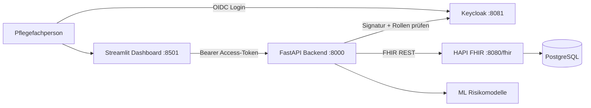

# Pflege Monitoring FHIR

Deutsch | [English](#english)

## Deutsch

### Überblick

Pflege Monitoring FHIR ist eine containerisierte Demo-Anwendung für die pflegerische Verlaufsdokumentation. Das System verbindet ein Streamlit-Dashboard, eine FastAPI-Anwendung, einen HAPI-FHIR-Server und PostgreSQL. Klinische Daten werden als FHIR-Ressourcen gespeichert; das Frontend speichert keine Patientendaten lokal.

> Hinweis: Die Anwendung verwendet synthetische Demonstrationsdaten und ML-Modelle. Sie ist kein Medizinprodukt und ersetzt weder eine professionelle pflegerische Einschätzung noch klinische Entscheidungen.

### Funktionen

- Patienten anlegen, suchen, Stammdaten ändern und nach Bestätigung löschen
- Suche nach Nachname, Vorname und Geburtsdatum
- Vitalzeichen und Assessments erfassen:
	- Blutdruck mit systolischem und diastolischem Wert
	- Herzfrequenz, Temperatur, Atemfrequenz und Sauerstoffsättigung
	- Schmerz-, Mobilitäts- und Morse-Sturzscore
- Patientenbezogene Verlaufskurven für alle numerischen Messwerte
- Pflegeakte mit Diagnosen, Medikamenten, Allergien, Pflegeberichten und Pflegeplänen
- Risikoeinschätzung für Sturz, Dekubitus, Schmerzeskalation und klinische Verschlechterung
- Fachlich lesbare Observationsdetails sowie Statuskorrektur und Löschung von Observationen
- Vollständiger Patientenbericht mit Stammdaten, Pflegeakte, letzten Messwerten und Risikoeinschätzungen

### Architektur



| Komponente | Technologie | Aufgabe |
| --- | --- | --- |
| Frontend | Streamlit | Pflege-Dashboard und Dokumentation |
| Backend | FastAPI / Uvicorn | Validierte API und FHIR-Proxy |
| FHIR-Server | HAPI FHIR | Speicherung der klinischen Ressourcen |
| Datenbank | PostgreSQL 16 | Persistenz für HAPI FHIR |
| ML | scikit-learn / joblib | Synthetische Pflege-Risikoeinschätzungen |

### Zugriffsschutz

- Nicht angemeldete Personen werden vom Dashboard direkt zur Keycloak-Anmeldung weitergeleitet.
- Das Backend validiert Signatur, Ablaufzeit, Issuer, Audience und autorisierten Client jedes Access-Tokens.
- Die Client-Rollen `pflege_read`, `pflege_write`, `pflege_delete` und `pflege_admin` begrenzen Lese-, Schreib- und Löschzugriffe.
- HAPI FHIR und beide Datenbanken sind nur in internen Docker-Netzen erreichbar. Klinische Daten sind nicht über einen eigenen Host-Port zugänglich.
- API-Zugriffe werden strukturiert mit Request-ID, Status, Route und Benutzerkennung protokolliert; Patientendaten und Token werden nicht in das Audit-Log geschrieben.

Die Compose-Konfiguration ist für die lokale Entwicklung an `127.0.0.1` gebunden. Für einen extern erreichbaren Produktivbetrieb sind zusätzlich TLS an einem Reverse Proxy und Keycloak im Produktionsmodus erforderlich.

### Schnellstart mit Docker

Voraussetzung: Docker Desktop mit Docker Compose.

```powershell
Copy-Item .env.example .env
# Alle Werte mit "replace-with-a-random-value" durch starke, unterschiedliche Secrets ersetzen.
docker compose up --build
```

Beim ersten Start lädt Docker die HAPI- und PostgreSQL-Images und installiert die Python-Abhängigkeiten. Der FHIR-Server benötigt etwas Zeit für seine Initialisierung. Sobald die Dienste bereit sind, sind diese Adressen verfügbar:

| Dienst | Adresse |
| --- | --- |
| Pflege-Dashboard | http://localhost:8501 |
| Backend-API / OpenAPI | http://localhost:8000/docs |
| Keycloak | http://localhost:8081 |

Der HAPI-FHIR-Server besitzt absichtlich keine öffentliche Adresse. Zugriffe erfolgen ausschließlich über das authentifizierte Backend.

Zum Beenden:

```powershell
docker compose down
```

Die FHIR- und Keycloak-Daten bleiben in benannten Docker-Volumes erhalten. Achtung: Der folgende Befehl löscht sowohl klinische Daten als auch die komplette Benutzer- und Rollenkonfiguration unwiderruflich:

```powershell
docker compose down -v
```

### Anwendung bedienen

1. Öffne das Dashboard unter http://localhost:8501. Ohne aktive Sitzung folgt sofort die Keycloak-Anmeldung.
2. Melde dich beim ersten lokalen Start mit `pflege.demo` und dem in `.env` gesetzten `DEMO_USER_PASSWORD` an und ändere das temporäre Kennwort.
3. Lege unter **Patient aufnehmen** einen Patienten an.
4. Öffne **Patienten**, suche den Patienten und wähle ihn aus.
5. Bearbeite bei Bedarf die Stammdaten. Löschen erfordert zusätzlich `pflege_delete` oder `pflege_admin`.
6. Dokumentiere unter **Übersicht** oder **Observationen** die Vitalzeichen und Assessments.
7. Verwende in der Patientenübersicht die **Pflegeakte**, um Diagnosen, Medikamente, Allergien, Pflegeberichte und Maßnahmen zu dokumentieren.
8. Öffne **Observationen**, um den Verlauf als Kurve und den automatisch erzeugten Patientenbericht zu sehen.

### FHIR-Ressourcen

| Pflegeinhalt | FHIR-Ressource |
| --- | --- |
| Stammdaten | `Patient` |
| Vitalzeichen und Scores | `Observation` |
| Diagnosen | `Condition` |
| Medikamente | `MedicationStatement` |
| Allergien | `AllergyIntolerance` |
| Pflegebericht | `ClinicalImpression` |
| Pflegeplanung und Maßnahmen | `CarePlan` |
| Risikoeinschätzung im Backend | `RiskAssessment`-kompatible Antwort |

### Risikoeinschätzung

Für eine vollständige Modellberechnung müssen folgende Merkmale vorhanden sein:

- Geburtsdatum und Geschlecht
- Herzfrequenz
- systolischer und diastolischer Blutdruck
- Temperatur
- Atemfrequenz
- Sauerstoffsättigung
- Schmerzscore
- Mobilitätsscore
- Morse-Sturzscore

Fehlen Werte, zeigt die Anwendung transparent an, dass die Daten unvollständig sind. Dies verhindert, dass aus einer unvollständigen Datengrundlage eine scheinbar verlässliche Wahrscheinlichkeit abgeleitet wird.

### API-Übersicht

Die interaktive und vollständige API-Beschreibung steht nach dem Start unter http://localhost:8000/docs bereit.

| Methode | Pfad | Zweck |
| --- | --- | --- |
| `POST` | `/Patient` | Patienten anlegen |
| `GET` | `/Patient` | Patienten suchen |
| `GET`, `PUT`, `DELETE` | `/Patient/{patient_id}` | Patient lesen, ändern, löschen |
| `POST`, `GET` | `/Observation` | Observation anlegen, suchen |
| `GET`, `PATCH`, `DELETE` | `/Observation/{observation_id}` | Observation lesen, Status ändern, löschen |
| `POST`, `GET` | `/Patient/{patient_id}/clinical-records/{record_type}` | Pflegeakte speichern und lesen |
| `GET` | `/Patient/{patient_id}/nursing-risk-assessment` | Risikoeinschätzung abrufen |

Erlaubte Werte für `record_type` sind `Condition`, `MedicationStatement`, `AllergyIntolerance`, `ClinicalImpression` und `CarePlan`.

### Lokale Entwicklung

Für den vollständigen Authentifizierungsfluss wird Docker Compose empfohlen. Python-Tests können unabhängig davon lokal ausgeführt werden:

```powershell
python -m venv .venv
.\.venv\Scripts\Activate.ps1
pip install -r requirements.txt
```

```powershell
.\.venv\Scripts\python.exe -m pytest -q
```

### Konfiguration

| Variable | Standardwert | Verwendung |
| --- | --- | --- |
| `FHIR_SERVER_URL` | `http://localhost:8080/fhir` | FHIR-Basisadresse im Backend |
| `FHIR_CONNECT_TIMEOUT` | `3.05` | Verbindungs-Timeout zum FHIR-Server in Sekunden |
| `FHIR_READ_TIMEOUT` | `15` | Lese-Timeout zum FHIR-Server in Sekunden |
| `FHIR_RETRY_TOTAL` | `2` | Wiederholungen ausschließlich für idempotente FHIR-Lesezugriffe |
| `FHIR_MAX_RESPONSE_BYTES` | `10485760` | Maximale Größe einer FHIR-Antwort |
| `BACKEND_API_URL` | `http://localhost:8000` | Backend-Basisadresse im Frontend |
| `KEYCLOAK_ISSUER` | lokaler Realm | Erwarteter Token-Issuer |
| `KEYCLOAK_API_AUDIENCE` | `monitoring-pflege-api` | Erforderliche Token-Audience und Rollen-Client |
| `OIDC_CLIENT_SECRET` | kein Standardwert | Vertrauliches Frontend-Client-Secret |
| `OIDC_COOKIE_SECRET` | kein Standardwert | Signatur-Secret für die Streamlit-Sitzung |
| `DEMO_USER_PASSWORD` | kein Standardwert | Temporäres Kennwort des lokalen Demo-Benutzers |

Alle erforderlichen Werte sind in [.env.example](.env.example) dokumentiert. Echte Secrets gehören ausschließlich in die ignorierte `.env`-Datei.

### Projektstruktur

```text
backend/
	app/
		main.py                 FastAPI-Routen
		fhir_ml/                FHIR-Client und ML-Risikologik
		models/                 Pydantic-Eingabemodelle
frontend/
	app.py                    Streamlit-Dashboard
	application/              Transformationen für UI-Daten
	domain/                   UI-Datenmodelle
	infrastructure/           Backend-API-Client
docker-compose.yml          Gesamtsystem: PostgreSQL, HAPI, Backend, Frontend
requirements.txt            Python-Abhängigkeiten
```

### Validierung

```powershell
.\.venv\Scripts\python.exe -m py_compile frontend/app.py backend/app/main.py
docker compose config
docker compose build backend frontend
```

---

## English

### Overview

Pflege Monitoring FHIR is a containerized demonstration application for nursing documentation and patient trends. It combines a Streamlit dashboard, a FastAPI application, a HAPI FHIR server, and PostgreSQL. Clinical data is stored as FHIR resources; the frontend does not persist patient data locally.

> Notice: The application uses synthetic demonstration data and ML models. It is not a medical device and does not replace professional nursing assessment or clinical decision-making.

### Features

- Create, search, edit, and confirmed-delete patients
- Search by family name, given name, and date of birth
- Record vital signs and assessments:
	- Blood pressure with systolic and diastolic values
	- Heart rate, temperature, respiratory rate, and oxygen saturation
	- Pain, mobility, and Morse fall scores
- Patient-specific trend charts for all numeric observations
- Nursing record for diagnoses, medications, allergies, nursing reports, and care plans
- Risk assessment for falls, pressure ulcers, pain escalation, and clinical deterioration
- Clinician-friendly observation details, status correction, and observation deletion
- A consolidated patient report with demographics, clinical record, recent observations, and risk assessments

### Architecture


| Component | Technology | Responsibility |
| --- | --- | --- |
| Frontend | Streamlit | Nursing dashboard and documentation UI |
| Backend | FastAPI / Uvicorn | Validated API and FHIR proxy |
| FHIR server | HAPI FHIR | Storage for clinical resources |
| Database | PostgreSQL 16 | Persistence layer for HAPI FHIR |
| ML | scikit-learn / joblib | Synthetic nursing risk assessments |

### Access Control

- Unauthenticated visitors are redirected directly to Keycloak.
- The backend validates token signature, expiry, issuer, audience, and authorized client.
- Client roles separate read, write, delete, and administrative access.
- HAPI FHIR and both databases are only reachable through internal Docker networks.

The Compose setup binds its public services to `127.0.0.1` for local development. An externally reachable production deployment additionally requires TLS at a reverse proxy and Keycloak production mode.

### Quick Start with Docker

Requirement: Docker Desktop with Docker Compose.

```powershell
Copy-Item .env.example .env
# Replace every placeholder with a strong, unique secret.
docker compose up --build
```

On the first run, Docker downloads the HAPI and PostgreSQL images and installs the Python dependencies. The FHIR server needs a short initialization period. Once the services are ready, use:

| Service | Address |
| --- | --- |
| Nursing dashboard | http://localhost:8501 |
| Backend API / OpenAPI | http://localhost:8000/docs |
| Keycloak | http://localhost:8081 |

HAPI FHIR intentionally has no public host address. All clinical access goes through the authenticated backend.

Stop the stack:

```powershell
docker compose down
```

FHIR and Keycloak data are retained in named Docker volumes. Warning: the following command irreversibly deletes clinical data as well as users and roles:

```powershell
docker compose down -v
```

### Dashboard Workflow

1. Open the dashboard at http://localhost:8501. Without a session, it immediately opens Keycloak login.
2. On the first local start, sign in as `pflege.demo` with `DEMO_USER_PASSWORD` from `.env` and change the temporary password.
3. Create a patient under **Patient aufnehmen**.
4. Open **Patienten**, search for the patient, and select the record.
5. Edit demographic details. Deletion additionally requires `pflege_delete` or `pflege_admin`.
6. Record vital signs and assessments under **Übersicht** or **Observationen**.
7. Use the **Pflegeakte** section in the patient overview to document diagnoses, medications, allergies, nursing reports, and care interventions.
8. Open **Observationen** to review trend charts and the generated patient report.

### FHIR Resources

| Clinical content | FHIR resource |
| --- | --- |
| Demographics | `Patient` |
| Vital signs and scores | `Observation` |
| Diagnoses | `Condition` |
| Medications | `MedicationStatement` |
| Allergies | `AllergyIntolerance` |
| Nursing report | `ClinicalImpression` |
| Care planning and interventions | `CarePlan` |
| Backend risk assessment | `RiskAssessment`-compatible response |

### Risk Assessment

A complete model calculation requires these data points:

- Date of birth and gender
- Heart rate
- Systolic and diastolic blood pressure
- Temperature
- Respiratory rate
- Oxygen saturation
- Pain score
- Mobility score
- Morse fall score

When values are absent, the dashboard explicitly reports incomplete data. This avoids presenting a seemingly reliable probability based on insufficient clinical information.

### API Summary

After startup, the interactive and complete API documentation is available at http://localhost:8000/docs.

| Method | Path | Purpose |
| --- | --- | --- |
| `POST` | `/Patient` | Create a patient |
| `GET` | `/Patient` | Search patients |
| `GET`, `PUT`, `DELETE` | `/Patient/{patient_id}` | Read, update, or delete a patient |
| `POST`, `GET` | `/Observation` | Create or search observations |
| `GET`, `PATCH`, `DELETE` | `/Observation/{observation_id}` | Read, update status, or delete an observation |
| `POST`, `GET` | `/Patient/{patient_id}/clinical-records/{record_type}` | Create or list nursing-record entries |
| `GET` | `/Patient/{patient_id}/nursing-risk-assessment` | Retrieve a risk assessment |

Allowed `record_type` values are `Condition`, `MedicationStatement`, `AllergyIntolerance`, `ClinicalImpression`, and `CarePlan`.

### Local Development

Docker Compose is recommended for the complete authentication flow. Python tests can run locally without it:

```powershell
python -m venv .venv
.\.venv\Scripts\Activate.ps1
pip install -r requirements.txt
```

```powershell
.\.venv\Scripts\python.exe -m pytest -q
```

### Configuration

| Variable | Default | Purpose |
| --- | --- | --- |
| `FHIR_SERVER_URL` | `http://localhost:8080/fhir` | FHIR base URL used by the backend |
| `FHIR_CONNECT_TIMEOUT` | `3.05` | FHIR connection timeout in seconds |
| `FHIR_READ_TIMEOUT` | `15` | FHIR read timeout in seconds |
| `FHIR_RETRY_TOTAL` | `2` | Retries for idempotent FHIR reads only |
| `FHIR_MAX_RESPONSE_BYTES` | `10485760` | Maximum FHIR response size |
| `BACKEND_API_URL` | `http://localhost:8000` | Backend base URL used by the frontend |
| `KEYCLOAK_ISSUER` | local realm | Expected token issuer |
| `KEYCLOAK_API_AUDIENCE` | `monitoring-pflege-api` | Required token audience and role client |
| `OIDC_CLIENT_SECRET` | no default | Confidential frontend client secret |
| `OIDC_COOKIE_SECRET` | no default | Streamlit session-signing secret |
| `DEMO_USER_PASSWORD` | no default | Temporary local demo-user password |

All required values are documented in [.env.example](.env.example). Real secrets belong only in the ignored `.env` file.

### Project Structure

```text
backend/
	app/
		main.py                 FastAPI routes
		fhir_ml/                FHIR client and ML risk logic
		models/                 Pydantic input models
frontend/
	app.py                    Streamlit dashboard
	application/              UI data transformations
	domain/                   UI data models
	infrastructure/           Backend API client
docker-compose.yml          Complete stack: PostgreSQL, HAPI, backend, frontend
requirements.txt            Python dependencies
```

### Validation

```powershell
.\.venv\Scripts\python.exe -m py_compile frontend/app.py backend/app/main.py
docker compose config
docker compose build backend frontend
docker compose up -d
```
