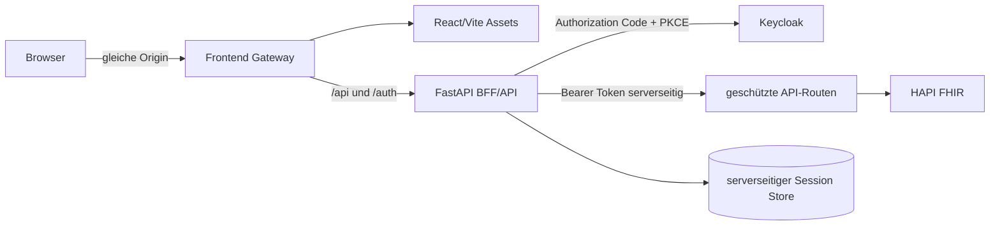

# React-Frontend: Zielarchitektur

Status: React-Zielarchitektur implementiert; fachliche Erweiterungen erfolgen inkrementell.

## Ziel und Grenzen

Das Frontend ist eine arbeitsorientierte, mehrseitige React-Anwendung für Pflegefachkräfte, Stationspersonal sowie Ärztinnen und Ärzte. Es greift ausschließlich über das authentifizierte Backend auf klinische Daten zu. HAPI FHIR bleibt aus dem Browser unerreichbar.

Diese Planung erfindet keine bereits verfügbaren Daten. Station, Zimmer, aggregierte Warnungen, `MedicationRequest`, `Procedure` und historische `RiskAssessment`-Ressourcen können erst dargestellt werden, nachdem passende Backend-Verträge existieren.

## Bestand

- React 19, TypeScript im Strict Mode und Vite bilden das einzige Frontend.
- Ein zentraler TypeScript-API-Client nutzt ausschließlich relative Same-Origin-Pfade; Zod validiert kritische Antworten zur Laufzeit.
- FHIR-Mapper transformieren Ressourcen in eigene UI-Domainmodelle, sodass React-Komponenten keine komplexen FHIR-Pfade auswerten.
- Das Backend authentifiziert Bearer Tokens und erzwingt die Rollen `pflege_read`, `pflege_write`, `pflege_delete` und `pflege_admin` serverseitig.
- Das Backend gibt überwiegend rohe FHIR-Ressourcen oder Bundles zurück. Nur die experimentelle `RiskAssessment`-Antwort hat ein festes Response-Schema.

## Zielbild



Für die lokale Entwicklung leitet der Vite-Dev-Proxy `/api` und `/auth` an FastAPI weiter. Im Produktionsbetrieb liefert ein gehärteter Webserver die gebauten Assets aus und proxyt dieselben Pfade. Browser, API und Auth-BFF bilden dadurch eine Origin; HAPI bleibt intern.

## Empfohlene Quellstruktur

```text
frontend/
├── src/
│   ├── app/
│   │   ├── config/
│   │   ├── providers/
│   │   ├── router/
│   │   └── styles/
│   ├── pages/
│   │   ├── dashboard/
│   │   ├── patients/
│   │   ├── patient-detail/
│   │   └── access-denied/
│   ├── features/
│   │   ├── auth/
│   │   ├── patient-search/
│   │   ├── observations/
│   │   ├── clinical-timeline/
│   │   └── risk-assessment/
│   ├── entities/
│   │   ├── patient/
│   │   ├── observation/
│   │   ├── clinical-event/
│   │   └── risk-assessment/
│   └── shared/
│       ├── api/
│       ├── auth/
│       ├── components/
│       ├── errors/
│       ├── formatters/
│       ├── validation/
│       └── types/
├── tests/
└── public/
```

Abhängigkeiten zeigen nur nach innen: `pages` komponieren `features`; Features verwenden `entities` und `shared`; FHIR-DTOs verlassen `shared/api` beziehungsweise die Mapper nicht.

## Datenfluss

```text
HTTP-Antwort
  → Zod Runtime Validation
  → schmaler FHIR DTO
  → reiner FHIR Mapper
  → Domain Model oder explizites Partial/Invalid-Ergebnis
  → React-Komponente
```

Fehlende Werte bleiben `undefined` beziehungsweise werden als `unavailable` modelliert. Mapper dürfen niemals klinische Werte mit `0`, `false`, einem aktuellen Zeitpunkt oder Beispieltext auffüllen.

## Routing

- `/` – Dashboard mit ausschließlich tatsächlich verfügbaren aggregierten Daten.
- `/patients` – Suche, Filter und Liste.
- `/patient` – Detailansicht des aktuell im Speicher gewählten Patienten, ohne Name, Geburtsdatum oder Patient-ID in der Browser-URL.
- `/access-denied` – gesperrte Ansicht ohne zwischengespeicherte klinische Inhalte.

Ein tiefer Link mit FHIR-ID in der URL wird zunächst nicht vorgesehen. Falls Deep Links später zwingend werden, soll das Backend einen kurzlebigen, opaken Navigationsbezug ausstellen.

## Server State

TanStack Query verwaltet ausschließlich flüchtigen Serverzustand:

- keine Persistenz in `localStorage`, `sessionStorage` oder IndexedDB;
- kurze, fachlich begründete `staleTime`- und `gcTime`-Werte;
- vollständiges Entfernen des Query-Caches bei Logout, `401`, `403` und Benutzerwechsel;
- keine automatischen Wiederholungen bei `401`, `403`, `409`, `412` oder Validierungsfehlern;
- begrenzte Wiederholungen nur für sichere Lesezugriffe und vorübergehende Netzwerkfehler;
- Mutationen invalidieren nur betroffene Query Keys.

## UI-Grundstruktur

Das erste Sichtfeld ist eine klinische Arbeitsfläche, keine Marketing-Hero-Section:

- kompakte Primärnavigation;
- klarer Sitzungs- und Rollenstatus;
- Arbeitskontext und Zeitpunkt der Datenaktualisierung;
- wenige, semantisch beschriftete Statuskarten;
- explizite Loading-, Empty-, Partial-, Error-, Unauthorized- und Offline-Zustände.

Das Design verwendet neutrale Flächen, hohe Kontraste, zurückhaltendes Petrol/Blau und semantische Statusfarben mit zusätzlichem Text und Symbol. Animationen sind minimal und respektieren `prefers-reduced-motion`.

## Umgesetzter Betriebsstand

1. React/Vite wird als statisches Produktions-Bundle gebaut und ausschließlich über Nginx ausgeliefert.
2. Auth-BFF und Same-Origin-Gateway halten OAuth-Tokens vollständig außerhalb des Browsers.
3. Zentraler API-Client, Zod-Schemas, Fehlerunionen, Query Provider und Error Boundary sind umgesetzt.
4. Patientenliste, Patientenaufnahme, Patientendetail, Observationen, Vitalwerte, Trends und Pflegedokumentation nutzen reale Backend-Verträge.
5. Unterstützte klinische Ressourcen werden über Mapper und eine gemeinsame Timeline dargestellt; fehlende Daten bleiben explizit nicht verfügbar.
6. Experimentelle `RiskAssessment`-Ergebnisse bleiben auf den deaktivierten beziehungsweise klar gekennzeichneten Demo-Modus begrenzt.

## Backend-Voraussetzungen für den vollständigen Zielumfang

- serverseitige OAuth-Session/BFF-Endpunkte;
- datensparsame Patienten-Suche ohne Namen oder Geburtsdaten in Query-Strings;
- serverseitige Pagination statt vollständiger Bundle-Aggregation für große Listen;
- explizite Endpunkte und validierte Schreibmodelle für `MedicationRequest` und `Procedure`;
- fachlich definierte Abbildung von Station und Zimmer über `Location`; der aktive `Encounter` und die Fallkennung sind umgesetzt;
- aggregierter Dashboard-Vertrag, um N+1-Anfragen und PHI-Übertragung zu vermeiden;
- persistierte Assessment-Historie, falls Assessment-ID, Quelle und Verlauf angezeigt werden sollen;
- RiskAssessment-Metadaten für Modellversion, verwendete Features und Datenbasis;
- ETag/Versionsverträge für weitere mutierbare Ressourcen; für Pflegeberichte ist `If-Match` bereits umgesetzt.

Bis diese Verträge vorliegen, bleibt der entsprechende UI-Umfang bewusst reduziert.
